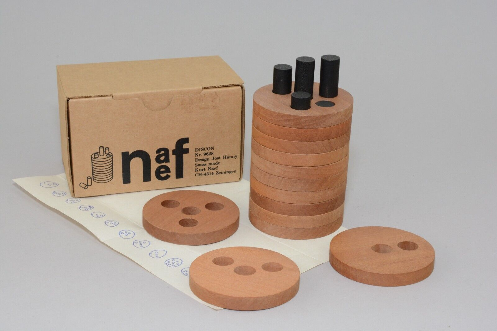

# Discon

Solver for the [Discon](http://www.2ndlook.nl/3dpuzzles/puzzles/pintower/engdescription.htm) puzzle (Kurt NAEF Nr. 9628) by Jost Hänny.

# Solutions

The solver finds [25626 different solutions](solutions.txt). However, the number of solutions depends on how you count the different symmetrical solutions:
